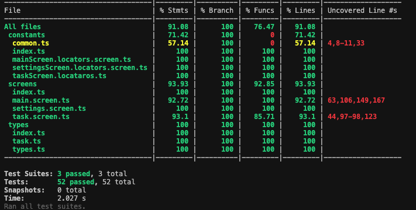

# 📱 Todo App - Mobile Test Automation

[](https://github.com/yourusername/todo-app-automation/actions)
[](https://webdriver.io/)
[](https://appium.io/)
[](https://www.typescriptlang.org/)
[](https://jestjs.io/)
[](https://mochajs.org/)
[](https://www.chaijs.com/)
[](https://webdriver.io/)
[](https://hub.docker.com/r/mybono/todo-app-automation)

Automated testing framework for Todo mobile application using Appium and WebDriverIO with TypeScript.

## 📋 Table of Contents

- [Overview](#overview)
- [Technology Stack](./docs/stack.md)
- [Project Structure](./docs/structure.md)
- [Prerequisites](#prerequisites)
- [Installation](#installation)
- [Running Tests](#running-tests)
- [CI/CD Pipeline](#cicd-pipeline)
- [Test Documentation](./docs/TestPlan.md)
- [Test Reports](#test-reports)
- [Troubleshooting](./docs/troubleshooting.md)
- [TODO](#todo)
- [Notes](#notes)

## Overview

This project implements automated tests for a Todo mobile application covering:

- ✅ Task creation and management (add, edit, delete)
- ✅ Task editing with validation
- ✅ Task deletion with confirmation
- ✅ Task completion/activation (checkbox functionality)
- ✅ Task filtering (All, Active, Completed)
- ✅ Navigation between screens (Tasks, Settings, Statistics)
- ✅ UI validation and push notifications

## [Technology Stack](./docs/stack.md)

## [Project Structure](./docs/structure.md)

## [Prerequisites](./docs/prerequisites.md)

## Installation

### 1. Clone Repository

```bash
git clone https://github.com/yourusername/todo-app-automation.git
cd todo-app-automation
```

### 2. Install Dependencies

```bash
npm install
```

This installs:

- WebDriverIO and Appium drivers
- TypeScript compiler
- Testing frameworks (Mocha, Chai)
- Linting tools (ESLint, Prettier)

### 3. Install Appium Globally (Optional)

```bash
npm install -g appium
appium driver install uiautomator2
```

### 4. Prepare APK

Place your application APK in:

```
app/apk/app-debug.apk
```

### 5. Start Android Emulator

```bash
# List available emulators
emulator -list-avds

# Start emulator
appium
OR
emulator -avd <emulator_name> -no-snapshot-load
```

Or start via Android Studio AVD Manager.

### 6. Verify Device Connection

```bash
adb devices
# Output should show: emulator-5554    device
```

## Alternative Installation via Docker

You can run all tests and the Appium server without installing Node.js, Appium, or Android SDK locally by using our prebuilt Docker image.

### Pull and Run the Docker Image

```bash
# Pull the image from Docker Hub
docker pull mybono/todo-app-automation:latest
```

### Run tests inside the container

```bash
docker run --rm -it \
  -v $(pwd)/reports:/usr/src/app/reports \
  -p 4723:4723 \
  mybono/todo-app-automation:latest
```

## 📘 Explanation of Flags

| Flag                                     | Description                                                               |
| ---------------------------------------- | ------------------------------------------------------------------------- |
| `-v $(pwd)/reports:/usr/src/app/reports` | Mounts local reports folder so test reports persist outside the container |
| `-p 4723:4723`                           | Exposes Appium default port                                               |
| `--rm`                                   | Removes container after execution                                         |
| `-it`                                    | Interactive mode (shows logs in real time)                                |

---

🔍 Note about `--rm`

- `--rm` deletes the container after tests finish, but the Docker image remains on your machine.
  You will NOT need to download it again unless you manually delete the image.

## 📦 [Docker Hub Image](https://hub.docker.com/r/mybono/todo-app-automation)

## ✅ Benefits

- No need to install **Node.js**, **Appium**, **Android SDK**
- Fully isolated test environment
- Consistent behavior across all machines
- Ready-to-run **CI/CD friendly** setup

## Running Tests

### Build & Run All Tests

```bash
npm test
```

This command:

1. Compiles TypeScript (`npm run build`)
2. Starts Appium server automatically
3. Executes all tests in `src/tests/`

### 📸 Screenshots on Test Failure

All failed E2E tests automatically capture screenshots for easier debugging.  
Screenshots are saved to: reports/screenshots

### Generate Report

```bash
npm report
```

### Development Commands

```bash
# Lint code
npm run lint

# Fix linting issues
npm run lint:fix

# Format code with Prettier
npm run format

# Clean build artifacts
npm run clean

# Build TypeScript
npm run build
```

### Manual Appium Server (Optional)

If you want to control Appium server manually:

```bash
# Terminal 1: Start Appium
appium --log-level debug:debug --relaxed-security

# Terminal 2: Run tests
npx wdio run wdio.conf.ts
```

## CI/CD Pipeline

### GitHub Actions Workflow

The project includes automated PR quality checks in `.github/workflows/pr-quality-check.yml`:

```yaml
name: 🔍 PR Checks

on:
  pull_request:
    branches: [main]
    types: [opened, synchronize, reopened]
```

### Pipeline Stages


#### 1. **Unit Tests** 🧪

- Runs unit tests using **Jest** with coverage.
- Jest unit tests cover the **core logic** of the main application classes:
  - **MainScreen** – task creation, selection, and completion logic.
  - **SettingsScreen** – applying filters, navigating menus, opening statistics.
  - **TaskScreen** – task editing, saving, and deletion workflows.



#### 2. **Lint TypeScript** 🧹

- Runs ESLint on all `.ts` files
- Checks code quality and standards
- Non-blocking (warnings only)

```bash
npm run lint
```

#### 3. **Dependency Check** 📦

- Detects changes in `package.json` or `package-lock.json`
- Alerts reviewers about:
  - Security vulnerabilities
  - License compliance
  - Bundle size impact

#### 4. **Auto-format with Prettier** 🎨

- Automatically formats code
- Commits changes back to PR
- Excludes `.github/` workflows
- Only commits if changes detected

**Auto-commit behavior:**

```bash
git commit -m "style: auto-format code with Prettier"
git push origin HEAD:<branch-name>
```

### How It Works

1. **Developer creates PR** → Pipeline triggers
2. **Linting runs** → Shows code quality issues
3. **Dependency check** → Alerts on package changes
4. **Prettier runs** → Automatically formats & commits
5. **Tests run locally** → Manual verification before merge

## [Test Documentation](./docs/TestPlan.md)

**📄 Complete test documentation is available at: [docs/TestPlan.md](./docs/TestPlan.md)**

The test plan includes:

- **User Needs & Risk Analysis** - 7 user needs and 4 identified risks
- **Requirements Mapping** - 10 functional requirements with priorities
- **Detailed Test Cases** - 17 test cases across 4 test suites:
  - **Task Management** (4 tests): UITM-TA001 - UITM-TA004
  - **Checkbox Actions** (4 tests): UITM-CA001 - UITM-CA004
  - **Filters** (6 tests): UITM-FE001 - UITM-FE003, UITM-FH001 - UITM-FH003
  - **Navigation** (4 tests): UITM-NA001 - UITM-NA004
- **Priority & Severity Definitions** - P1-P4 and S1-S4 classifications
- **Traceability Matrix** - Complete mapping from inputs to test cases

## Test Reports

### Console Output

Tests output to console with colored logs:
[Full Console Logs](./docs/test-logs.md)

### Allure Reports

```bash
npm run report
```


## [Troubleshooting](./docs/troubleshooting.md)

## TODO

- Develop test scenarios and implement tests to verify the app's behavior under unexpected device events:
  - Network loss (Wi-Fi / mobile data)
  - Screen rotation (portrait ↔ landscape)
  - Device lock and unlock
  - Background app interruptions
  - Sudden screen off
  - Battery drain / low battery simulation
- Develop & Implement Slack notification servise

## [NOTES](./docs/notes.md)

### Best Practices Implemented

- ✅ Page Object Model for maintainability
- ✅ Factory pattern for screen initialization
- ✅ Custom logger with log levels
- ✅ Timeout constants for consistency
- ✅ Random test data generation
- ✅ Error handling with descriptive messages
- ✅ TypeScript for type safety
- ✅ ESLint for code quality
- ✅ Prettier for consistent formatting

## Resources

- [WebDriverIO Documentation](https://webdriver.io/)
- [Appium Documentation](https://appium.io/docs/en/latest/)
- [UiAutomator2 Driver](https://github.com/appium/appium-uiautomator2-driver)
- [Android Debug Bridge (ADB)](https://developer.android.com/tools/adb)
- [TypeScript Documentation](https://www.typescriptlang.org/docs/)
- [Mocha Test Framework](https://mochajs.org/)

## Contributing

1. Create feature branch: `git checkout -b feature/new-tests`
2. Make changes and ensure tests pass: `npm test`
3. Run linting: `npm run lint:fix`
4. Format code: `npm run format`
5. Commit: `git commit -m "feat: add new test cases"`
6. Push: `git push origin feature/new-tests`
7. Create Pull Request

## Support

For questions, issues, or contributions:

- Open an issue on GitHub
- Check the [Test Documentation](./docs/TestPlan.md)
- Review the [Troubleshooting](#-troubleshooting) section

---

_Last Updated: November 2025_
