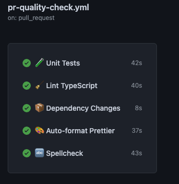
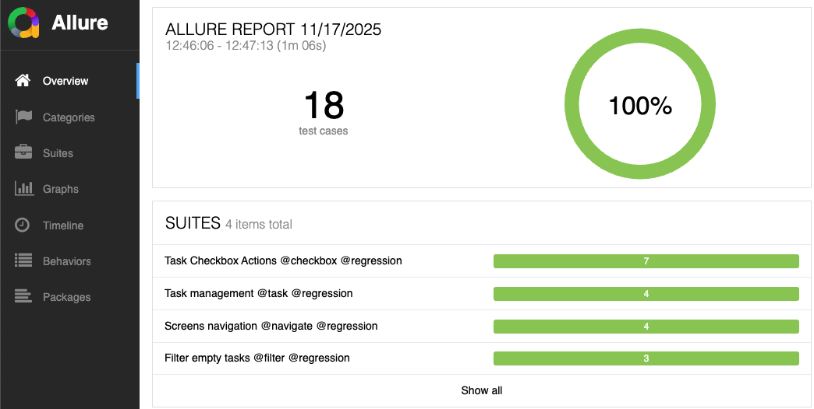
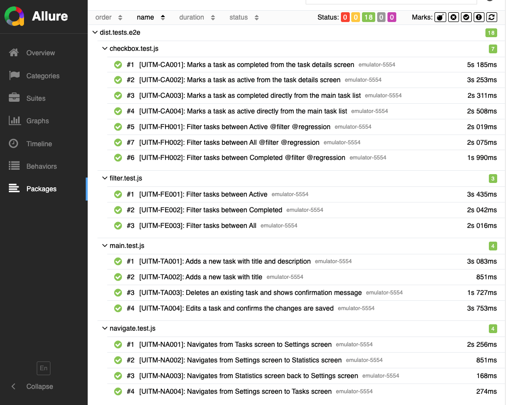

# 📱 Todo App - Mobile Test Automation

[](https://github.com/yourusername/todo-app-automation/actions)
[](https://webdriver.io/)
[](https://appium.io/)
[](https://www.typescriptlang.org/)
[](https://jestjs.io/)
[](https://mochajs.org/)
[](https://www.chaijs.com/)
[](https://webdriver.io/)
[](https://hub.docker.com/r/mybono/todo-app-automation)

## 📋 Table of Contents
- [Overview](#overview)
- [Prerequisites](#prerequisites)
- [Installation](#installation)
- [Technology Stack](./docs/stack.md)
- [Running Tests](#running-tests)
- [CI/CD Pipeline](#cicd-pipeline)
- [Test Documentation](./docs/TestPlan.md)
- [Project Structure](./docs/structure.md)
- [Test Reports](#test-reports)
- [API Documentation](#api-documentation)
- [Troubleshooting](./docs/troubleshooting.md)
- [Contributing](./CONTRIBUTING.md)
- [TODO](#todo)
- [Notes](#notes)

## Overview

This project implements automated tests for a Todo mobile application covering:

- ✅ Task creation and management (add, edit, delete)
- ✅ Task editing with validation
- ✅ Task deletion with confirmation
- ✅ Task completion/activation (checkbox functionality)
- ✅ Task filtering (All, Active, Completed)
- ✅ Navigation between screens (Tasks, Settings, Statistics)
- ✅ UI validation and push notifications

## [Prerequisites](./docs/prerequisites.md)

## [Installation](./docs/Installation.md)

## [Technology Stack](./docs/stack.md)

## [Project Structure](./docs/structure.md)

## Running Tests

### All Tests
```bash
npm test
```

### Specific Suite
```bash
# Build first (if not built)
npm run build

# Then run specific test
npx wdio run wdio.conf.ts --spec ./dist/tests/e2e/main.test.js       # Task Management
npx wdio run wdio.conf.ts --spec ./dist/tests/e2e/checkbox.test.js   # Checkbox Actions
npx wdio run wdio.conf.ts --spec ./dist/tests/e2e/filter.test.js     # Filters
npx wdio run wdio.conf.ts --spec ./dist/tests/e2e/navigate.test.js   # Navigation
```

## CI/CD Pipeline


GitHub Actions automatically runs on every Pull Request:

1. **🧹 Lint** - ESLint checks code quality
2. **📦 Dependencies** - Checks for security issues
3. **🎨 Format** - Auto-formats with Prettier
4. **✅ Tests** - Runs unit tests with Jest

View pipeline: [`.github/workflows/pr-quality-check.yml`](.github/workflows/pr-quality-check.yml)

## [Test Documentation](./docs/TestPlan.md)

**📄 Complete test documentation is available at: [docs/TestPlan.md](./docs/TestPlan.md)**

The test plan includes:

- **User Needs & Risk Analysis** - 7 user needs and 4 identified risks
- **Requirements Mapping** - 10 functional requirements with priorities
- **Detailed Test Cases** - 17 test cases across 4 test suites:
  - **Task Management** (4 tests): UITM-TA001 - UITM-TA004
  - **Checkbox Actions** (4 tests): UITM-CA001 - UITM-CA004
  - **Filters** (6 tests): UITM-FE001 - UITM-FE003, UITM-FH001 - UITM-FH003
  - **Navigation** (4 tests): UITM-NA001 - UITM-NA004
- **Priority & Severity Definitions** - P1-P4 and S1-S4 classifications
- **Traceability Matrix** - Complete mapping from inputs to test cases

## Test Reports
### Console Output

Tests output to console with colored logs:
[Full Console Logs](./docs/test-logs.md)

### Allure Reports

```bash
npm run report
```





## API Documentation
#### Main Screen
```typescript
// Add task
const taskSelector = await screens.main.addTask({
  title: "Buy milk",
  text: "From store",
  status: taskStatuses.active,
});

// Apply filter
await screens.main.applyFilter(filter.completed);

// Mark task complete
await screens.main.markTaskComplete(true, taskSelector);
```

#### Task Screen
```typescript
// Edit task
await screens.task.editTask({
  selector: taskSelector,
  title: "New title",
  text: "New description",
});

// Delete task
await screens.task.deleteTask(taskSelector);
```

## [Troubleshooting](./docs/troubleshooting.md)

## TODO

- Develop test scenarios and implement tests to verify the app's behavior under unexpected device events:
  - Network loss (Wi-Fi / mobile data)
  - Screen rotation (portrait ↔ landscape)
  - Device lock and unlock
  - Background app interruptions
  - Low battery simulation
  - Sudden screen off
- Develop Slack notification service
- Add iOS support
- Implement parallel test execution


## [NOTES](./docs/notes.md)

### Best Practices Implemented

- ✅ Page Object Model for maintainability
- ✅ Factory pattern for screen initialization
- ✅ Custom logger with log levels
- ✅ Unit tests
- ✅ Timeout constants for consistency
- ✅ Random test data generation
- ✅ Error handling with descriptive messages
- ✅ TypeScript for type safety
- ✅ ESLint for code quality
- ✅ Prettier for consistent formatting

## Resources

- [WebDriverIO Documentation](https://webdriver.io/)
- [Appium Documentation](https://appium.io/docs/en/latest/)
- [UiAutomator2 Driver](https://github.com/appium/appium-uiautomator2-driver)
- [Android Debug Bridge (ADB)](https://developer.android.com/tools/adb)
- [TypeScript Documentation](https://www.typescriptlang.org/docs/)
- [Mocha Test Framework](https://mochajs.org/)

---

<div align="center">


[](https://github.com/Mybono/todo-app-automation/stargazers)
[](https://github.com/Mybono/todo-app-automation/network/members)

*Last updated: November 2025*

</div>

